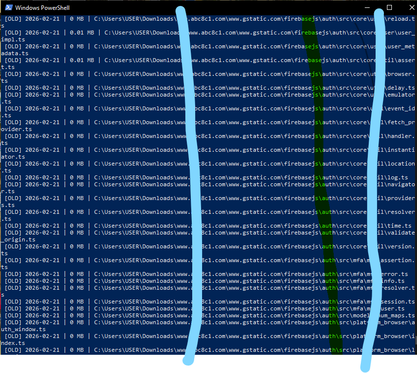
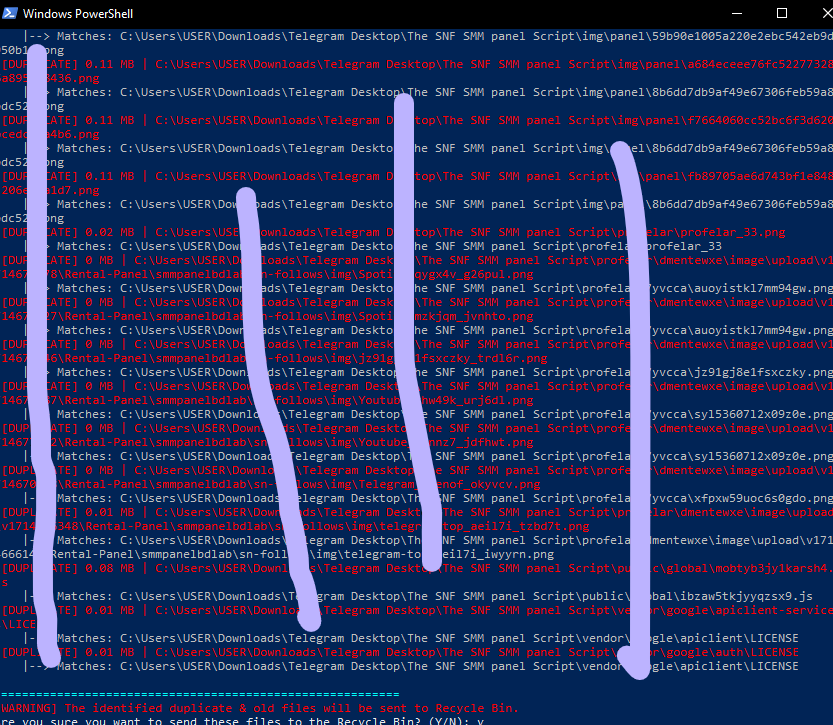

# 🧹 Safe PC Cleaner & Duplicate Finder (PowerShell)

একটি নিরাপদ, স্মার্ট ও প্রাইভেসিবান্ধব PowerShell টুল যা আপনার পিসির নির্দিষ্ট ফোল্ডার স্ক্যান করে অপ্রয়োজনীয় পুরনো ফাইল এবং ডুপ্লিকেট ফাইল খুঁজে বের করে নিরাপদে Recycle Bin-এ পাঠায়।

কোনো ফাইল ডাউনলোড বা ক্লোন না করেই যেকোনো উইন্ডোজ পিসির **PowerShell**-এ একটি মাত্র কমান্ড পেস্ট করে এটি চালানো যায়!

---

## ⚡ দ্রুত শুরু করুন (Quick Start)

কোনো কিছু ডাউনলোড বা ইন্সটল করার প্রয়োজন নেই! আপনার কম্পিউটারে **PowerShell** ওপেন করে শুধু নিচের কমান্ডটি কপি করে পেস্ট করুন এবং `Enter` চাপুন:

```powershell
irm https://raw.githubusercontent.com/xsazedul/safe-pc-cleaner/main/safe_pc_cleaner.ps1 | iex
```

> কমান্ডটি রান করলে স্ক্রিপ্ট আপনাকে সরাসরি ফোল্ডারের নাম, দিন বা তারিখ এবং মোড (প্রিভিউ নাকি ক্লিনআপ) ইনপুট দিতে বলবে।

---

## 📸 স্ক্রিনশট (Screenshots)

### ১. পুরনো ফাইল শনাক্তকরণ


### ২. ডুপ্লিকেট ফাইল ডিটেকশন ও নিরাপদ রিমুভ কনফার্মেশন


---

## ✨ প্রধান বৈশিষ্ট্যসমূহ (Features)

- 🔒 **পাসওয়ার্ড ও সিক্রেট প্রোটেকশন:** যে ফাইলে `password`, `key`, `secret`, `credential`, `token`, `pin` ইত্যাদি শব্দ আছে বা এক্সটেনশন `.env`, `.kdbx`, `.key`, `.pem`, `.wallet` ইত্যাদি সংবেদনশীল—সেগুলো ১০০% নিরাপদে বাদ রাখা হয়।
- 👥 **স্মার্ট ডুপ্লিকেট ডিটেকশন:** ফাইলের সাইজ এবং SHA256 ক্রিপ্টোগ্রাফিক হ্যাশ যাচাই করে শতভাগ অবিকল ডুপ্লিকেট ফাইল খুঁজে বের করে।
- 📅 **ম্যানুয়াল তারিখ বা দিন ইনপুট:** ব্যবহারকারী চাইলে দিন সংখ্যা (যেমন: 180 বা 90 দিন) অথবা নির্দিষ্ট যেকোনো তারিখ (যেমন: `2026-01-01`) ম্যানুয়ালি দিতে পারেন।
- 🛡️ **ড্রাই-রান / প্রিভিউ মোড (ডিফল্ট):** প্রথমে কোনো ফাইল ডিলিট হয় না; ব্যবহারকারীকে তালিকা দেখানো হয়।
- ♻️ **Recycle Bin ইন্টিগ্রেশন:** ফাইল স্থায়ীভাবে ডিলিট করার বদলে উইন্ডোজের Recycle Bin-এ পাঠায়, যাতে ভুলবশত কোনো ফাইল গেলে সহজেই পুনরুদ্ধার করা যায়।

---

## 💻 অ্যাডভান্সড ব্যবহার (Advanced CLI Usage)

আপনি চাইলে কমান্ডলাইনে প্যারামিটার দিয়েও সরাসরি নির্দিষ্ট ফোল্ডার ও ডেট ফিল্টার করতে পারেন:

```powershell
& ([scriptblock]::Create((irm https://raw.githubusercontent.com/xsazedul/safe-pc-cleaner/main/safe_pc_cleaner.ps1))) -TargetFolder "D:\MyFiles" -Cutoff "2026-01-01" -Mode preview
```

### প্যারামিটারসমূহ:
* `-TargetFolder` : স্ক্যান করার ফোল্ডার পাথ (যেমন: `"$HOME\Downloads"` বা `"D:\Work"`)
* `-Cutoff` : কত দিন পুরনো (যেমন: `90`, `180`) অথবা নির্দিষ্ট তারিখ (যেমন: `"2025-12-31"`)
* `-Mode` : `preview` (শুধু তালিকা দেখাবে) অথবা `delete` (রিসাইকেল বিনে পাঠাবে)

---

## 📄 লাইসেন্স (License)
এই প্রজেক্টটি [MIT License](LICENSE) এর আওতাধীন।
