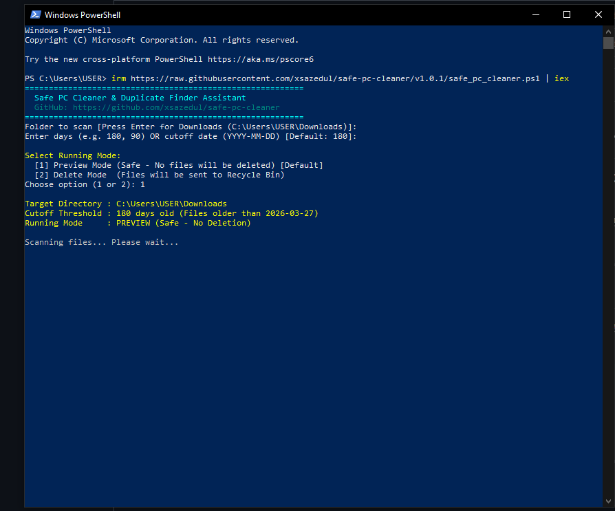
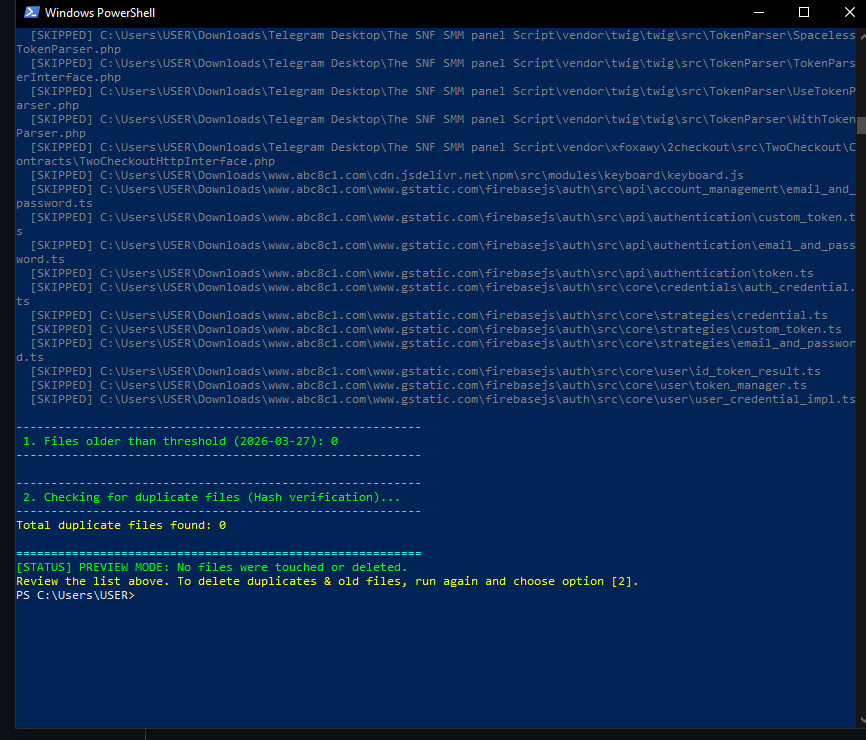

# 🧹 Safe PC Cleaner & Duplicate Finder (PowerShell)

[](LICENSE)
[](https://www.microsoft.com/windows)
[](https://github.com/PowerShell/PowerShell)

A safe, privacy-focused, and intelligent PowerShell automation utility to identify unused old files and duplicate files on Windows — without risking passwords, private keys, or system-critical files.

Run instantly with a **single command** in Windows PowerShell. No downloads, cloning, or manual setup required!

---

## ⚡ Quick Start (Instant Run)

Open **Windows PowerShell** and paste the command below:

```powershell
irm https://raw.githubusercontent.com/xsazedul/safe-pc-cleaner/v1.0.1/safe_pc_cleaner.ps1 | iex
```

> **Interactive Experience:** The script will automatically prompt you for the target folder, age/date cutoff threshold, and execution mode (Preview vs. Delete).

---

## 📸 Screenshots

### 1. Interactive CLI & Mode Selection


### 2. Sensitive File Protection & Scan Results


---

## ✨ Key Features

- 🔒 **Password & Secret Protection:** Automatically scans for and skips sensitive files containing keywords like `password`, `key`, `secret`, `credential`, `token`, `pin` or file extensions like `.env`, `.kdbx`, `.key`, `.pem`, `.wallet`.
- 👥 **Cryptographic Duplicate Detection:** Uses file size comparison and **SHA-256 cryptographic hashing** to accurately identify 100% identical duplicate files.
- 📅 **Flexible Cutoff (Custom Days or Specific Date):** Filter files older than a custom number of days (e.g., `90` or `180` days) or before a specific date (e.g., `2026-01-01`).
- 🛡️ **Default Dry-Run / Preview Mode:** Runs safely by default without deleting or touching any files until you explicitly select Delete mode.
- ♻️ **Safe Recycle Bin Routing:** Never permanently purges files — moves selected items directly to the **Windows Recycle Bin**, allowing easy restoration at any time.

---

## 💻 Advanced CLI Usage

Advanced users can pass command-line arguments directly to customize folder scans:

```powershell
& ([scriptblock]::Create((irm https://raw.githubusercontent.com/xsazedul/safe-pc-cleaner/v1.0.1/safe_pc_cleaner.ps1))) -TargetFolder "D:\MyFiles" -Cutoff "2026-01-01" -Mode preview
```

### Parameters:
* `-TargetFolder` : Path to directory to scan (Defaults to `$HOME\Downloads`)
* `-Cutoff` : Age threshold in days (e.g., `90`, `180`) or specific cutoff date (e.g., `"2025-12-31"`)
* `-Mode` : `preview` (dry-run review only) or `delete` (send approved files to Recycle Bin)

---

## 🤝 Contributing

Contributions, issues, and feature requests are welcome! Feel free to check the [issues page](https://github.com/xsazedul/safe-pc-cleaner/issues).

---

## 📄 License

This project is licensed under the [MIT License](LICENSE).
